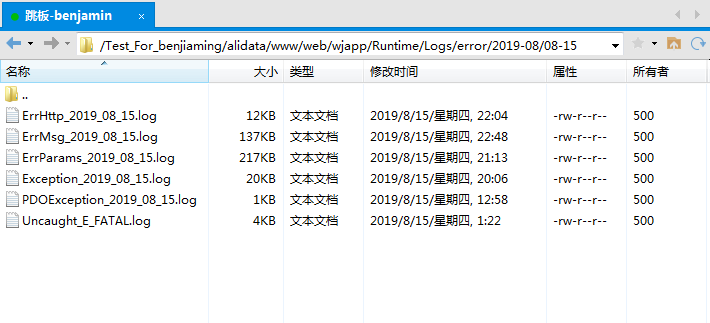
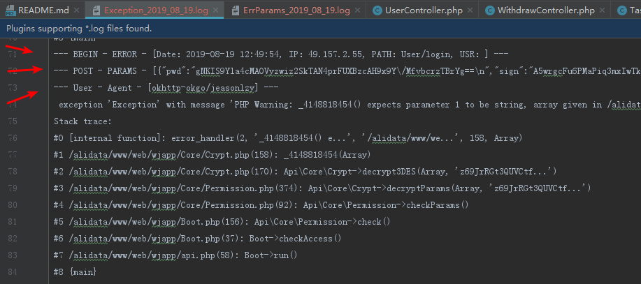

# 异常处理

## 异常分层

```php

[ 'ErrMsg', 'ErrParams', 'ErrHttp', 'ErrSign', 'ErrRedis', 'PDOException', 'RedisException', 'Exception', 'Throwable' ]

```

## 异常捕捉

```php
try {

    include API_PATH . 'Boot.php';
    (new Boot())->run();

} catch (ErrParams $e) {  # 参数错误
    ErrInfoHandler($e, 'ErrParams', $appConf);
    Boot::$di['response']->setErrCode(1)->sendJson($e->getMessage());
} catch (ErrSign $e) {    # 签名错误
    ErrInfoHandler($e, 'ErrSign', $appConf);
    Boot::$di['response']->setErrCode(1)->setHttpCode($e->getCode())->sendJson($e->getMessage());
} catch (ErrMsg $e) {  # 直接展示给用户的异常信息
    ErrInfoHandler($e, 'ErrMsg', $appConf);
    Boot::$di['response']->setErrCode(1)->sendJson($e->getMessage());
} catch (ErrHttp $e) { # 带有http状态的异常信息：throw new ErrHttp('msg', 403)
    ErrInfoHandler($e, 'ErrHttp', $appConf);
    Boot::$di['response']->setErrCode(1)->setHttpCode($e->getCode())->sendJson($e->getMessage());
} catch (ErrRedis $e) { # REDIS-连接异常
    ErrInfoHandler($e, 'ErrRedis', $appConf);
    Boot::$di['response']->setErrCode(1)->sendJson('缓存服务异常：' . $e->getMessage());
} catch (PDOException $e) { # 数据库相关异常信息
    ErrInfoHandler($e, 'PDOException', $appConf);
    Boot::$di['response']->setErrCode(1)->sendJson('数据库异常：' . $e->getMessage());
} catch (RedisException $e) { # 缓存服务异常-其他操作
    ErrInfoHandler($e, 'RedisException', $appConf);
    Boot::$di['response']->setErrCode(1)->sendJson('缓存服务异常：' . $e->getMessage());
} catch (Exception $e) { # 其他未定义或未捕捉到的异常 (PHP5异常基类：在7环境下不需要此项捕捉)
    ErrInfoHandler($e, 'Exception', $appConf);
    $msg = DEV_MODE === 3 ? '服务器异常，请稍后重试！' : $e->getMessage();
    Boot::$di['response']->setErrCode(1)->setHttpCode(500)->sendJson($msg);
} catch (Throwable $e) { # 其他未定义或未捕捉到的异常 (PHP7新增：异常基类，所有继承此类的异常都会被捕捉)
    ErrInfoHandler($e, 'Throwable', $appConf);
    $msg = DEV_MODE === 3 ? '服务器异常，请稍后重试！' : $e->getMessage();
    Boot::$di['response']->setErrCode(1)->setHttpCode(500)->sendJson($msg);
}

```

## 异常日志

异常日志会记录在项目: Runtime/Logs, 根据日志分类展示



## 日志详情

详情记录了日志类型，请求IP、请求路径、用户、参数、UA、以及错误消息内容和追溯，能很方便的对异常进行锁定和排查

